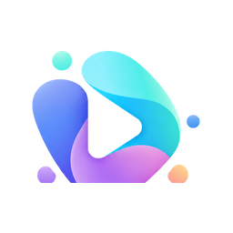
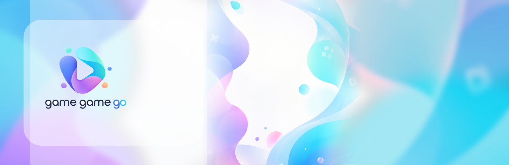
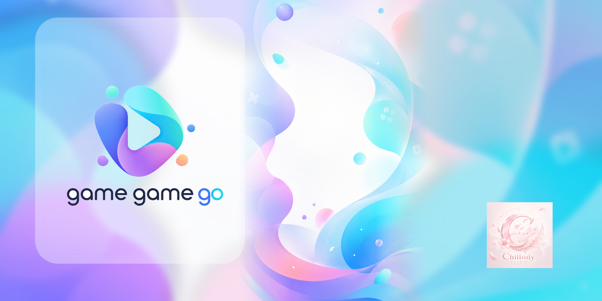

<p align="center">
  
</p>

<h1 align="center">Game Game Go</h1>

<p align="center">
  A modular desktop mini-game platform built with Python and Pygame.
</p>

<p align="center">
  <a href="https://github.com/Dyu20705/game-game-go/actions/workflows/ci.yml"></a>
  <a href="https://github.com/Dyu20705/game-game-go/actions/workflows/docker.yml"></a>
  
  
  
  <a href="LICENSE"></a>
</p>



## Overview

Game Game Go is a desktop arcade shell for local mini-games. The platform owns
the app lifecycle, registry, settings, save files, assets, audio orchestration,
shared UI and optional blockchain integration boundaries. Each game owns its own
rules, state, runtime and Pygame presentation.

The app is local/offline-first. Blockchain and ROFL code exists as scaffolded
and unit-tested integration work, not as a deployed production network.

## Games

- **Color Wars**: local turn-based strategy with PvP and PvBot AI.
- **SquareXO**: local 1v1 Dots-and-Boxes-style play with deterministic replay verification.
- **Nuts & Bolts**: solo sorting puzzle with generated levels.
- **Click Sprint**: tiny demo game used to prove the platform contract.

## Key Platform Features

- Protocol-based game module contract.
- Static composition root in `src.platform.bootstrap`.
- Versioned settings/save service with game namespaces.
- Canonical `assets/` root with source branding, optimized runtime branding,
  16:9 menu backgrounds and game thumbnails.
- Local blockchain adapters for development and tests.
- AST architecture tests guarding dependency boundaries.
- Docker profiles for test, smoke and optional local noVNC demo.

## Quick Start

```bash
python -m pip install -r requirements.txt
python -m src.main
```

For development tools:

```bash
python -m pip install pytest pytest-cov ruff
```

## Controls

Controls are game-specific, but common navigation is:

- `Esc`: return to library or close the current overlay.
- `F11`: toggle fullscreen in Color Wars flows.
- Mouse: select menu items and interact with game boards.
- Main menu keyboard: Up/Down/Tab changes focus; Enter/Space activates.

## Development

```bash
python -m ruff check src tests tools rofl/game-service/src rofl/game-service/tests
python -m ruff format --check src tests tools rofl/game-service/src rofl/game-service/tests
python -m compileall src tests tools rofl/game-service/src rofl/game-service/tests
python -m pytest -q -p no:cacheprovider
python -m tools.smoke_test
python -m tools.check_links
```

See [development setup](docs/development/setup.md), [testing](docs/development/testing.md)
and [contributing](docs/development/contributing.md).

## Docker Demo

Docker is for repeatable checks and local review, not production web hosting.

```bash
docker build .
docker compose --profile test run --rm test
docker compose --profile smoke run --rm smoke
docker compose --profile demo up demo
```

The demo profile exposes noVNC on `127.0.0.1:6080` for local review only. See
[Docker demo docs](docs/deployment/docker_demo.md).

## Blockchain Status

- Local/off-chain gameplay is the default.
- Solidity contracts, local adapters, commitment vectors and a Python ROFL
  service boundary exist for technical preparation.
- No Oasis Sapphire deployment is claimed.
- No production ROFL bundle is claimed.
- No real-money wagering, deposits, withdrawals, token payouts or NFT payouts
  are implemented.

See [blockchain prephase audit](docs/BLOCKCHAIN_PREPHASE_AUDIT.md) and
[threat model](docs/THREAT_MODEL.md).

## Project Structure

```text
src/
  main.py
  games/
    color_wars/
    demo_game/
    nuts_and_bolts/
    square_xo/
  platform/
    bootstrap/
    blockchain/
    games/
    scenes/
    services/
    ui/
assets/
  source_branding/
  branding/
  backgrounds/
  games/
docs/
tests/
docker/
```

## Release Package

Game Game Go currently ships as a lightweight Python runtime package. PyInstaller
is not a required dependency yet.

```bash
python -m tools.process_assets
python -m tools.build_release
```

The release zip is written to `dist/game-game-go-0.2.0-runtime.zip` with a
matching `.sha256` checksum.

## Documentation

Start with the [documentation index](docs/README.md).

Useful entry points:

- [Architecture](docs/ARCHITECTURE.md)
- [Architecture refactor report](docs/ARCHITECTURE_REFACTOR_REPORT.md)
- [Source dependency audit](docs/SRC_DEPENDENCY_AUDIT.md)
- [Documentation audit](docs/DOCUMENTATION_AUDIT.md)
- [Security policy](docs/security/security_policy.md)
- [Current roadmap](docs/roadmap/current.md)

## Screenshots

The committed social preview can be used in GitHub repository settings:



## Contributing

Keep platform code independent from game internals, register games through the
composition root and run the local quality checks before opening a pull request.

## Security

Do not commit private keys, seed phrases, wallet files, production RPC
credentials or deployment secrets. See [Security Policy](docs/security/security_policy.md).

## License

MIT. See [LICENSE](LICENSE).

## Acknowledgements

SquareXO source material was audited under Apache-2.0 terms; see
[third-party licenses](docs/THIRD_PARTY_LICENSES.md). Runtime brand images use
the provided Game Game Go / Chillody Studio identity under `assets/branding/`;
maintainable originals live under `assets/source_branding/`.
